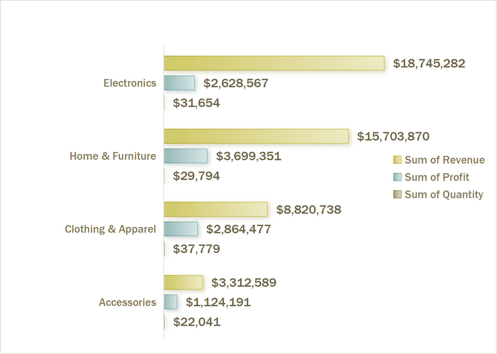
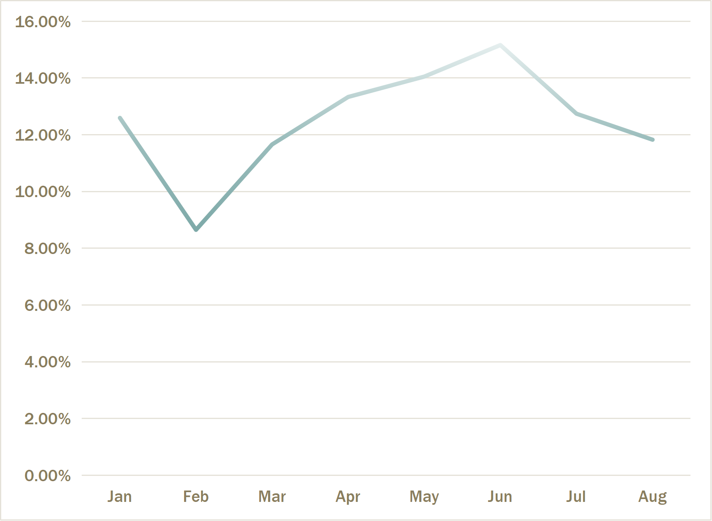
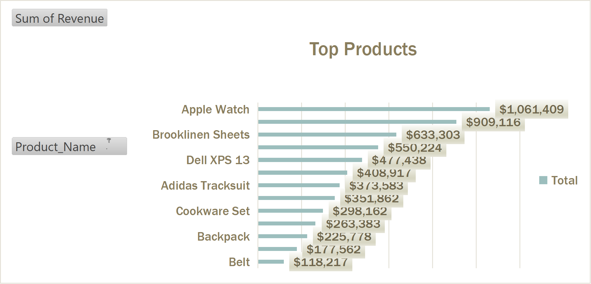

# Product_Sales_Analysis
# Product Sales Dashboard

## Project Overview
This project analyzes a retail sales data set containing customer transactions across multiple product categories, regions, and time periods. The objective is to identify revenue drivers, profitable product categories, seasonal sales patterns, and regional performance to support business decision-making.

## Tools Used
- Excel
-Pivot Tables
-Dashboard Design
-Pivot Charts
-Slicers
-Github

## Data Cleaning Process
The following data preparation steps were performed:
Checked for missing values
Verified data types
Converted order dates into proper date format
Standardized revenue and profit fields
Created a profit margin calculation
Removed inconsistencies in categorical fields

##  Key Performance Indicators (KPI’s) 

Total Revenue $46,582,479
Total Profit $10,316,586
Total Transactions 65,535
## Dashboard Components The Excel dashboard includes:
Total Revenue KPI
Total Profit KPI
Revenue by Category Chart
Monthly Sales Trend Chart
Regional Profit Analysis
Top Product Performance Chart &  Interactive Filters/Slicers

## Business Questions
1.Which product categories generate the highest revenue?
2.Which categories are the most profitable?
3.What are the monthly sales trends?
4.Which region contributes the highest profit?
5.Which products generate the most revenue?
6.What recommendations can improve future sales performance?
## Insights
-Electronics generated the highest overall revenue.
-Home & Furniture produced strong sales performance and significant profitability.
-Accessories contributed the smallest share of revenue.
-Home & Furniture is the most profitable category.
-Electronics generates the most revenue but not the highest profit.
-Profitability varies significantly between categories.

- November generated the highest revenue.
-Sales increased substantially during the holiday season.
-October through December represent the strongest sales period.

-East Region generated the highest profit.
-South Region recorded the lowest profitability.
-Regional differences may indicate varying customer demand and market opportunities.

Top Revenue-Generating Products
1.Tempur-Pedic Mattress
2.Instant Pot
3.MacBook Air
4.Apple Watch
5.Apple iPhone 14
6.iPad Pro
7.KitchenAid Mixer
8.Storage Rack
9.Brooklinen Sheets
10.Samsung Galaxy S23
Insights
Premium furniture and technology products dominate sales.
High-value products contribute significantly to total revenue.

## Charts 
-Generates Highest Revenue on Products

-Monthly Sales Trend

-Top 10 Products with most Revenue

## Recommendations
1.Increase Inventory Before Peak Season
Prepare additional inventory for October through December, especially November.
2. Focus on High-Revenue Electronics Products
Promote premium technology products through targeted marketing campaigns.
3. Expand High-Performing Regions
Invest more resources in East and West regions where profitability is strongest.
4. Improve South Region Performance
Investigate customer behavior and marketing effectiveness to increase profitability.
5. Promote Best-Selling Products
Use top-performing products as flagship items in advertising campaigns.

## Conclusion
The analysis shows that Electronics is the leading revenue-generating category, while Home & Furniture delivers the highest profitability. November is the strongest sales month, highlighting the impact of seasonal demand. Regional analysis reveals that the East region contributes the highest profit. These insights can support inventory planning, marketing strategies, and business growth initiatives.

